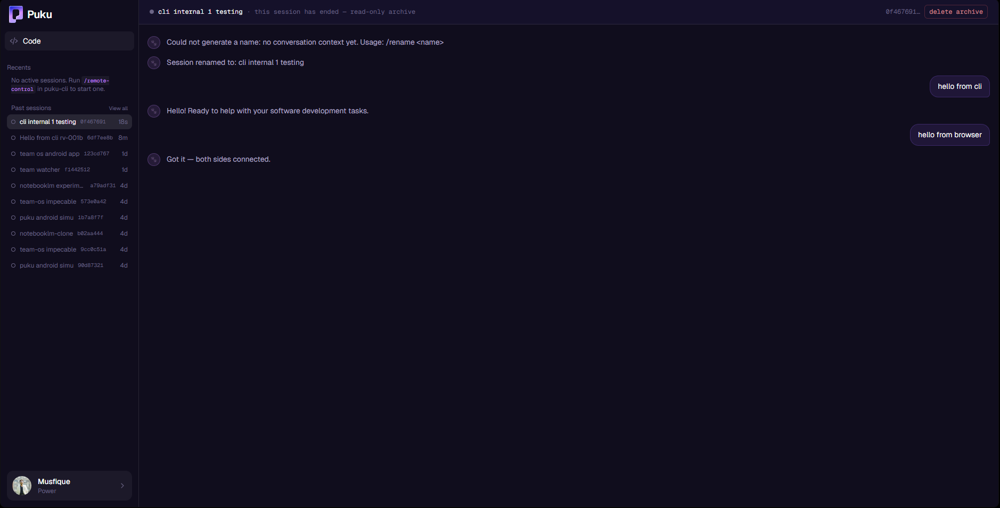
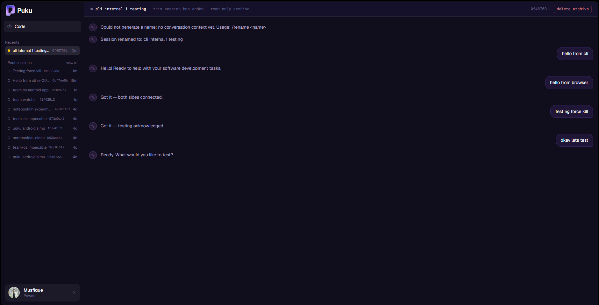
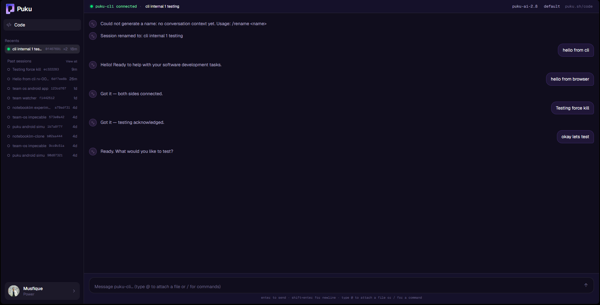
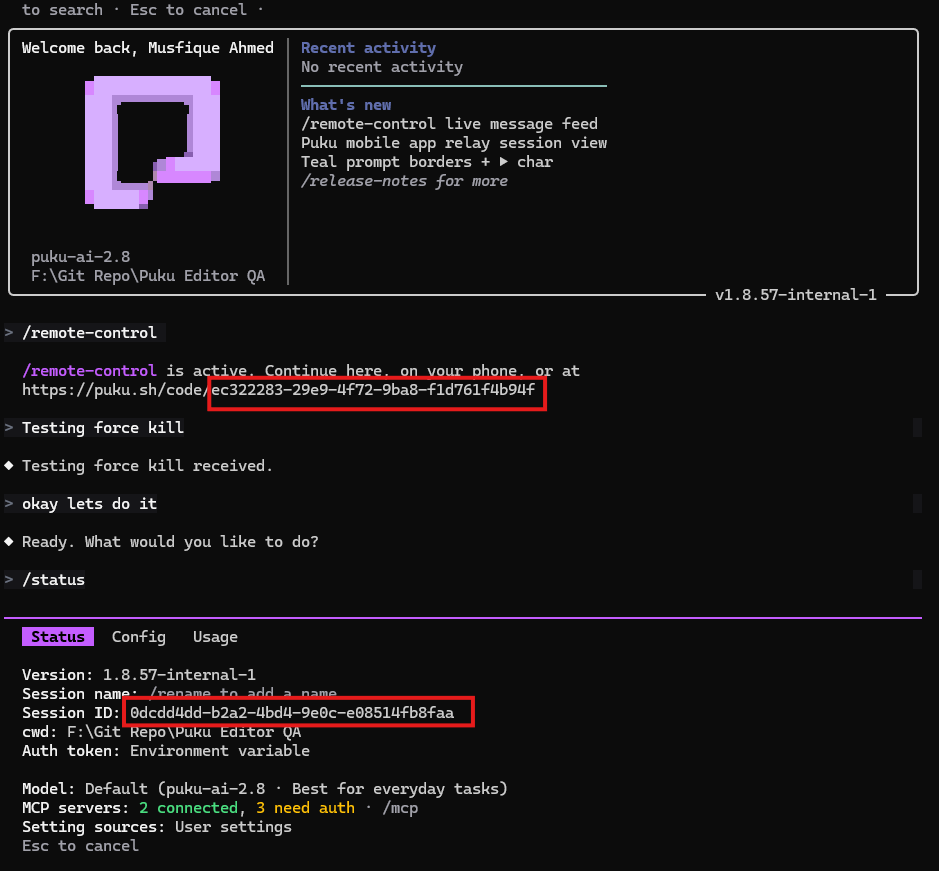
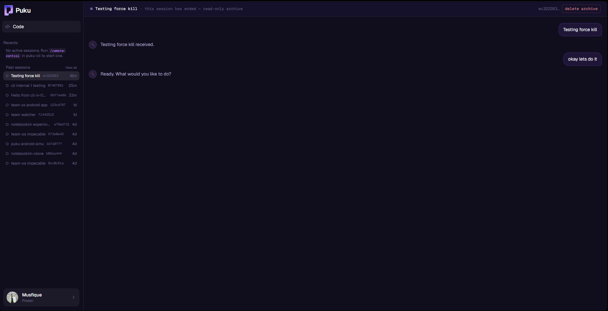
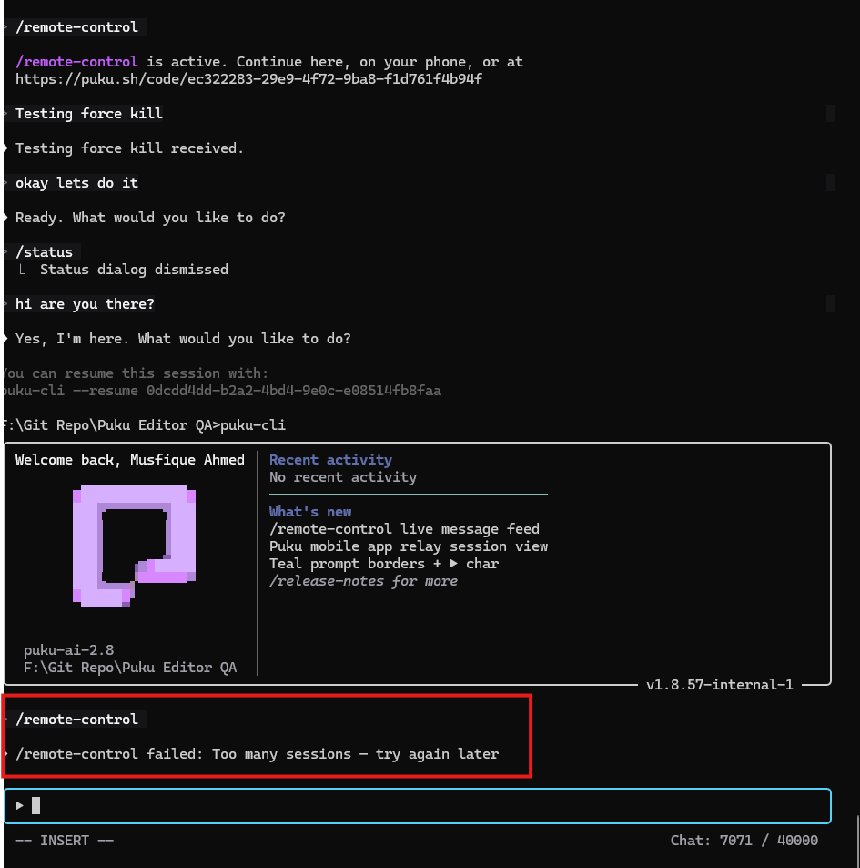

# Revive QA Test Report

**Tester:** Musfique
**Date:** 17 September 2026
**Environment:** Windows / Puku CLI / Browser
**Version:** 1.8.57-internal-1

## RV-001 — Graceful Exit

* **Session ID:** `0f467691-4a18-4431-a81a-989db9229977`
* **Action:** `/remote-control` → message exchange → `/exit`
* **Expected:** Session ends and moves to PAST.
* **Actual:** `Session ends and moves to PAST.`
* **Result:** PASS
* **Evidence:** Screenshot attached

## RV-002 — Force Kill

* **Session ID:** `ec322283-29e9-4f72-9ba8-f1d761f4b94f`
* **Action:** `/remote-control` → message exchange → Ctrl+C
* **Expected:** Session eventually moves to PAST.
* **Actual:** `Session eventually moves to PAST.`
* **Result:** PASS

## RV-003 — Resume After Graceful Exit

* **OLD_ID:** `0f467691-4a18-4431-a81a-989db9229977`
* **NEW_ID:** `0f467691-4a18-4431-a81a-989db9229977`
* **Same ID:** YES
* **Auto Remote Control:** YES
* **Transcript Preserved:** YES
* **Session Status:** LIVE
* **Result:** PASS (But we need to refresh the browser for the session to get the update, else the session thinks that it is still not running. Evidance:)

After reload:

## RV-004 — Resume After Force Kill

* **OLD_ID:** `ec322283-29e9-4f72-9ba8-f1d761f4b94f`
* **NEW_ID:** `0dcdd4dd-b2a2-4bd4-9e0c-e08514fb8faa`
* **Same ID:** NO
* **Auto Remote Control:** NO
* **Result:** FAIL

## RV-005 — Multiple Sessions

* **S1:** `<id>`
* **S2:** `<id>`
* **S3:** `<id>`
* **Resumed Session:** `<id>`
* **History Consistent:** YES / NO
* **Transcript Mixed:** YES / NO
* **Result:** FAIL
Couldn't even try this. I was said that i had  /remote-control failed: Too many sessions — try again later, although i had 0 Live session. It could happen because I was stress testing earlier.

## RV-006 — Two Browser Tabs

* **Same Transcript:** YES / NO
* **Messages Sync:** YES / NO
* **After Resume:** Working / Not working
* **Result:** PASS / FAIL
[Couldn't test because of the Too many sessions problem, but i tried it earlier it passes.]

## RV-007 — Delete History

* **Deleted Session:** `0f467691-4a18-4431-a81a-989db9229977`
* **Old Session Revived:** NO
* **New Session Created:** YES
* **Error / Crash:** NO
* **Result:** PASS

