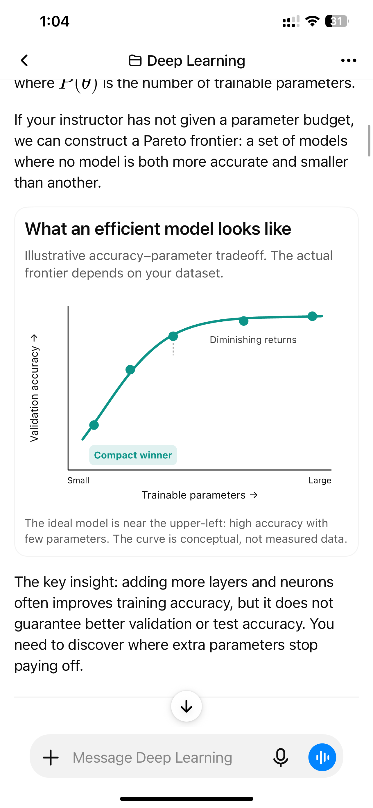
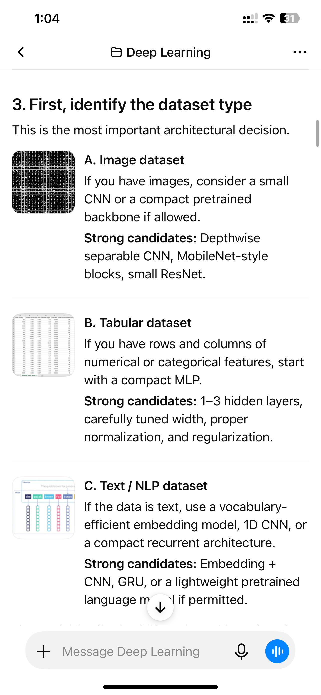
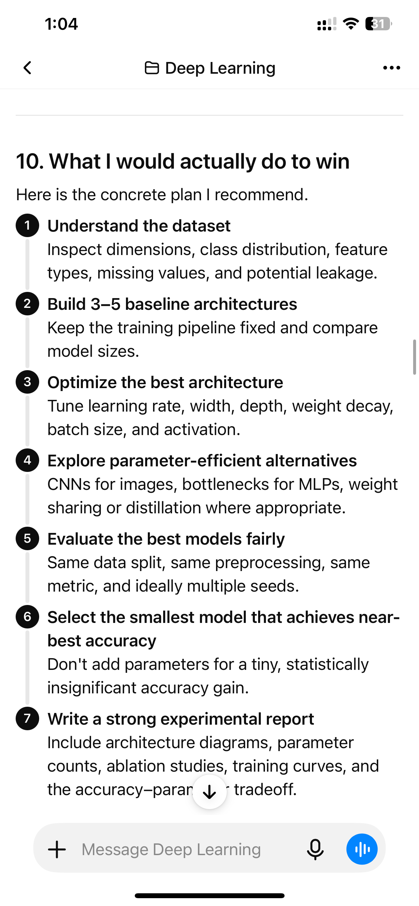
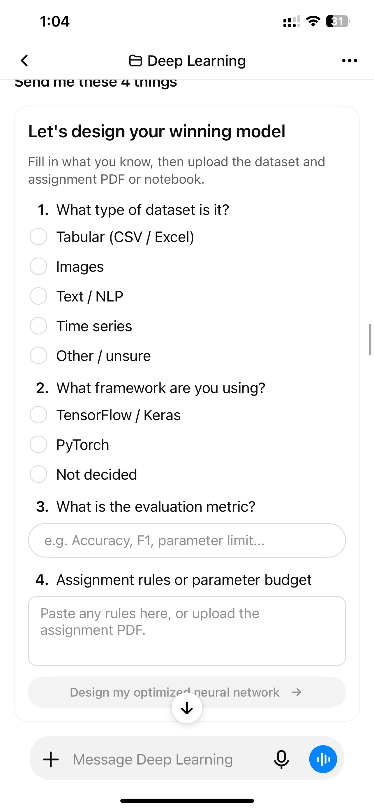
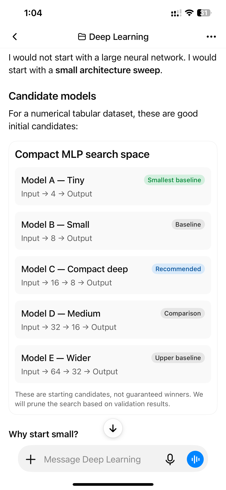
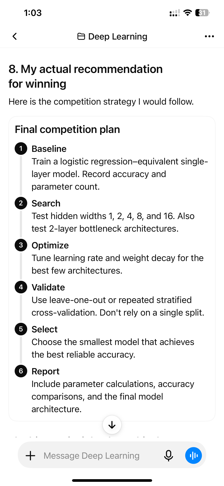
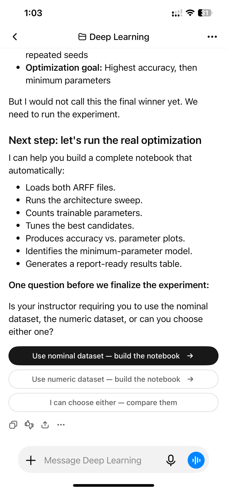

# Product Requirement: Make Puku Chat More Visual, Structured, and User-Friendly

## Summary

Puku Chat should move beyond primarily text-based responses and provide a richer, more structured chat experience similar to the ChatGPT responses shown in the attached screenshots.

The goal is not to copy ChatGPT's interface exactly. The goal is to make Puku responses easier to understand, easier to scan, and easier to act on by using appropriate visual layouts, structured cards, forms, buttons, charts, and step-by-step content when they genuinely improve the answer.

## Why this matters

A strong answer is not only about the quality of the information. The way the information is presented also affects how quickly users understand it and what they can do next.

The attached ChatGPT examples feel especially user-friendly because they:

- Break long explanations into clear sections.
- Use visual elements when text alone would be harder to understand.
- Present related information in cards and grouped layouts.
- Turn processes into numbered steps or timelines.
- Ask for missing information through an organized form instead of a vague follow-up question.
- Give users clear next actions through buttons.
- Make complex topics feel more like an interactive workspace than a long chat message.

Puku Chat should aim for the same quality of experience.

## Reference screenshots

The screenshots below are examples of the experience we want to learn from.

### Screenshot 1: Visual chart inside an explanation

The response explains a concept in text and then uses a clean chart to make the idea easier to understand.

What works well:

- The chart has a clear title.
- The purpose of the chart is explained before the visual.
- The axes are labelled.
- Important ideas such as diminishing returns are shown directly on the chart.
- The response clearly says that the chart is illustrative, so the user does not mistake it for measured data.
- The chart is placed exactly where it supports the explanation.

### Screenshot 2: Dataset types with visual examples

The response explains different dataset types and places a small visual example beside each one.

What works well:

- Each dataset type has its own section.
- The visual is placed next to the relevant explanation.
- The content is easy to scan.
- The user can quickly compare image, tabular, and text datasets.
- The response combines short explanations with practical recommendations.

### Screenshot 3: Numbered step-by-step plan

The response turns a long plan into a vertical sequence of numbered steps.

What works well:

- Each step has a clear number and title.
- The connecting line makes the order easy to follow.
- The main action is visually separated from the supporting explanation.
- The user can understand the complete process without reading a large paragraph.

### Screenshot 4: A structured input form

The response asks the user for information through a proper form.

The form includes:

- Radio-button choices.
- Text input for the evaluation metric.
- A larger text area for assignment rules or constraints.
- A clear primary action button.
- Helpful placeholder text.
- A short explanation of what the user should provide.

What works well:

- The user does not need to guess what information is required.
- The questions are grouped into one clear workflow.
- The form makes the next step obvious.
- The interaction feels like using a tool, not just replying to a chatbot.

### Screenshot 5: Model comparison card

The response presents candidate models inside a single comparison card.

What works well:

- Each model has a name and a short description.
- The architecture is shown in a simple format.
- Labels such as “Smallest baseline,” “Recommended,” and “Comparison” help the user understand the role of each option.
- The card makes multiple alternatives easier to compare.
- The response explains that these are starting candidates, not guaranteed winners.

### Screenshot 6: Final plan with clear actions

The response uses a structured card to present a complete plan from baseline to reporting.

What works well:

- The plan has a clear beginning and end.
- Each stage has a short title and explanation.
- The content is detailed without becoming visually confusing.
- The user can easily turn the plan into a checklist or implementation workflow.

### Screenshot 7: Clear next actions through buttons

The response ends with a focused question and several possible actions.

What works well:

- The user is asked one clear question.
- The possible answers are presented as buttons.
- Each button explains what will happen next.
- The primary action is visually emphasized.
- The user can continue without writing a new message manually.

## Product vision

Puku Chat should feel like a smart workspace that can explain, organize, and guide users—not only a text box that returns paragraphs.

When appropriate, Puku should be able to produce responses containing:

- Well-structured headings and sections.
- Information cards.
- Comparison cards.
- Step-by-step timelines.
- Checklists.
- Charts and simple diagrams.
- Images or visual examples.
- Forms with radio buttons, text inputs, and text areas.
- Clear action buttons.
- Follow-up choices that continue the conversation.
- Interactive previews when the task benefits from them.

These elements should be used based on the user's request and the content of the answer. The goal is not to add visuals everywhere. The goal is to use the right format for the right information.

## Detailed product requirements

### 1. Use the right presentation for the content

Puku should recognize when a response would be clearer as something other than plain text.

Examples:

- Use a chart for numerical comparisons or trends.
- Use a timeline for a process or plan.
- Use a comparison card for multiple options.
- Use a form when several pieces of information are needed from the user.
- Use buttons when the user has a small number of clear next actions.
- Use images when a visual example improves understanding.
- Use a checklist for tasks that users need to complete.

Plain text should remain the default when it is the clearest option.

### 2. Make visual elements part of the explanation

Visuals should not feel randomly inserted into the response.

Each visual should:

- Have a clear purpose.
- Appear close to the related explanation.
- Include a title or short description when needed.
- Use readable labels.
- Avoid unnecessary decoration.
- Clearly distinguish real data from illustrative or estimated data.

### 3. Improve long-answer structure

Long responses should be divided into meaningful sections rather than becoming one continuous block of text.

Recommended patterns include:

- A short introduction.
- Clear numbered sections.
- Cards for important groups of information.
- Short paragraphs.
- Bullets for supporting details.
- A concise conclusion or next step.

The user should be able to scan the response and understand its overall structure quickly.

### 4. Support useful interactive components

When the response requires information from the user, Puku should be able to present a structured input experience.

Possible components include:

- Single-choice radio buttons.
- Multiple-choice checkboxes where appropriate.
- Text inputs.
- Multi-line text areas.
- Dropdowns where there are many options.
- Date or number inputs when relevant.
- Submit buttons.
- Reset or edit actions when useful.

The form should explain:

- What information is needed.
- Why the information is needed, when useful.
- What will happen after submission.
- Which fields are required.

### 5. Make actions clear and meaningful

Buttons should not be added only for visual appearance.

Every button should have a clear purpose, such as:

- Continue with the selected option.
- Generate a plan.
- Compare alternatives.
- Create a draft.
- Run an analysis.
- Explain a topic differently.
- Show an example.
- Ask a focused follow-up question.

Button labels should describe the action or result. For example, “Build the notebook” is more useful than “Continue.”

### 6. Make comparisons easier

When Puku presents several options, it should use a layout that makes the differences obvious.

A comparison card may include:

- Option name.
- Short description.
- Key properties.
- Strengths or limitations.
- Recommended or baseline labels when justified.
- A clear action for selecting or exploring the option.

Puku should avoid presenting five or more alternatives as an unstructured paragraph.

### 7. Support charts and diagrams responsibly

Charts and diagrams should be accurate and clearly described.

Requirements:

- Do not invent data and present it as real.
- Clearly label illustrative or conceptual visuals.
- Use readable axes, legends, and labels.
- Choose a chart type that fits the data.
- Avoid unnecessary visual complexity.
- Include a short explanation of the key takeaway.
- Preserve the ability to read the explanation without interacting with the chart.

### 8. Keep responses usable on mobile

The attached examples are viewed on a phone, so the experience should work well on small screens.

Requirements:

- Cards should fit within the chat width.
- Text should remain readable without zooming.
- Buttons should be easy to tap.
- Forms should not feel cramped.
- Charts should resize appropriately.
- Long labels should wrap instead of being cut off.
- Visual elements should not cover the message composer.
- The user should be able to understand the response through scrolling.

### 9. Keep the experience consistent

Different response types should feel like part of the same Puku Chat experience.

The visual system should have consistent:

- Typography.
- Spacing.
- Border radius.
- Card style.
- Button style.
- Input style.
- Colors and emphasis.
- Error and loading states.

The interface should feel polished without becoming overly decorative.

### 10. Handle incomplete information gracefully

If Puku needs more information, it should avoid asking a vague question such as “Can you provide more details?”

Instead, it should explain exactly what is missing and, when useful, provide a structured form or a small set of choices.

For example:

- “What type of data are you using?” with selectable options.
- “What is your target metric?” with a text input.
- “What constraints should I follow?” with a text area.
- “Which option should I use?” with clear action buttons.

The user should be able to provide the missing information with minimal effort.

## Expected behavior examples

### Example A: Explaining a technical concept

Instead of returning only paragraphs, Puku may provide:

1. A short explanation.
2. A simple diagram or chart.
3. A highlighted key takeaway.
4. A short example.
5. A follow-up action such as “Show me a practical example.”

### Example B: Planning a task

Puku may provide:

1. A goal summary.
2. A numbered timeline.
3. A checklist.
4. Important constraints.
5. Buttons for the next step.

### Example C: Collecting requirements

Puku may provide:

1. A short explanation of what is needed.
2. A form with clear fields.
3. Helpful examples or placeholders.
4. A primary submit action.
5. A confirmation or next-step response after submission.

### Example D: Comparing options

Puku may provide:

1. A comparison card or table.
2. Short descriptions for each option.
3. Labels such as baseline, recommended, or alternative only when justified.
4. A clear way to choose or explore an option.

## Acceptance criteria

This product requirement can be considered successful when:

- Puku can produce responses that are more structured than plain paragraphs when the content benefits from structure.
- Puku can render useful cards for grouped information and comparisons.
- Puku can present step-by-step plans as readable timelines or numbered workflows.
- Puku can ask for missing information through structured forms when appropriate.
- Puku can provide clear, meaningful action buttons for common next steps.
- Puku can display charts or diagrams with readable labels and clear explanations.
- Visuals are used only when they improve comprehension or usability.
- The response remains understandable even if the user does not interact with the visual element.
- The experience works well on mobile screens.
- Interactive elements have clear states for loading, success, validation errors, and failure.
- The overall design feels consistent across different response types.
- The experience improves task completion and reduces the amount of manual typing required from users.

## Out of scope

This issue does not require Puku to copy ChatGPT's exact design, colors, typography, or internal implementation.

It also does not require every response to contain charts, buttons, forms, or cards. These elements should appear only when they are useful for the specific task.

## Final note

The attached screenshots demonstrate the level of clarity and usability that Puku Chat should aim for. The main opportunity is to make responses feel more like carefully designed, interactive workspaces while preserving the flexibility and naturalness of chat.
